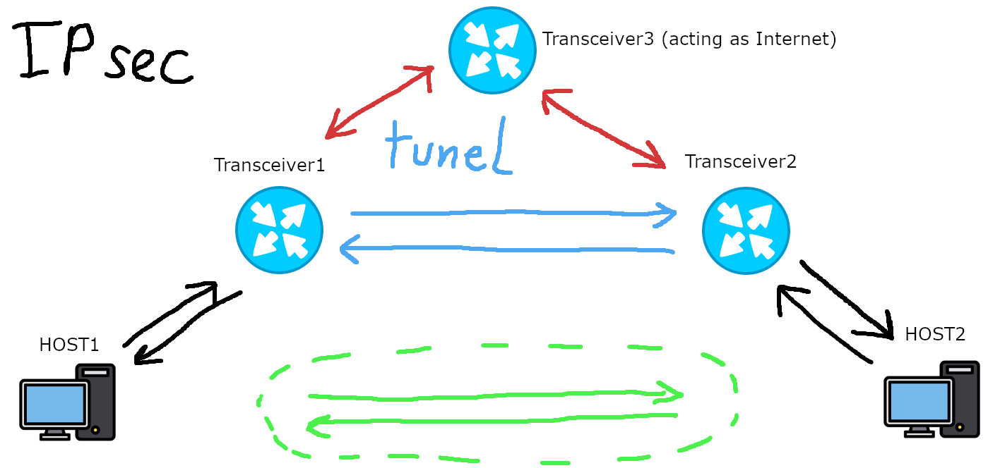

# ipsec-app
IPsec DEMONSTRATION as emulation project

# How to install for devs
## 1. npm
$ npm install
## 2. python virtual env
$ python3 -m venv venv 
## 3. activate venv (note that routers cannot work under windows)
(windows) .\venv\Scripts\activate 
(linux) source venv/bin/activate 
## 4. install python libs
$ pip install -r requirements.txt

# How to run
npm start

# How its working (step by step)
## Testing network setup

---
TODO (https://www.ciscopress.com/articles/article.asp?p=25474&seqNum=7)

1. HOST1 wants to send message or file to HOST2
2. Transceiver1 see that the transmission is "interesting" so it initializes IKE between Transceiver1 and Transceiver2
3. (IKE phase 1)
   1. checks if other peer(Transceiver2) is authenticated via for example "pre shared key"
   2. via diffie hellman it creates secure tunnel to exchange keys for phase 2
4. (IKE phase 2)
   1. Negotiates IPSec parameters protected by an existing tunnel
   2. Establishes IPSec security associations:
      1. Material for keys for encryption and authentication
      2. The algorithms that can be used
      3. The identities of the endpoints
5. Working IPsec tunnel
6. Tunnel Termination
---
# Example addressation
---

| ID | Network address      | Subnet mask           | Usable Host IP Range    |
| -- | -------------------- |:---------------------:| -----------------------:|
| 1  | 127.0.0.16           | 255.255.255.240       | 127.0.0.17 - 127.0.0.30 |
| 2  | 127.0.0.32           | 255.255.255.240       | 127.0.0.33 - 127.0.0.46 |
| 3  | 127.0.0.48           | 255.255.255.240       | 127.0.0.49 - 127.0.0.62 |

| Device name   |       IP      | Network ID |
| ------------- |:-------------:| ----------:|
| Router 1      | 127.0.0.16    |      1     |
| Host 1        | 127.0.0.17    |      1     |
| Router 2      | 127.0.0.32    |      2     |
| Router 3      | 127.0.0.48    |      3     |
| Host 2        | 127.0.0.49    |      3     |